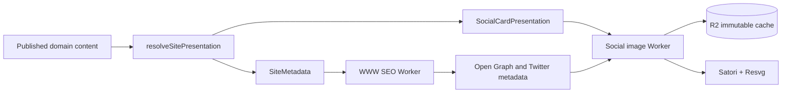

# ADR-0005: Hybrid site-wide social cards

## Status

Accepted

## Date

2026-09-19

## Context

The site metadata layer emits content-specific titles, descriptions, canonical URLs, Twitter tags, Open Graph tags, and JSON-LD for public content. Before this decision, only tweets used a generated 1200×630 preview. Mixes, shows, releases, labels, and profiles exposed raw square artwork, while editorials and static pages used a generic 1080×1080 image.

Every page declared `twitter:card=summary_large_image`, but most supplied an image with the wrong aspect ratio and no page title or site identity. The tweet implementation had also grown into a separate `@gbfm/tweet-card` contract and post-service endpoint even though its revisioning, rendering, R2 caching, and cleanup mechanics apply to all public content.

Three approaches were considered:

1. Put every raw image inside one generic 1200×630 frame. This is inexpensive but leaves identity-heavy content and editorials context-poor.
2. Build a bespoke contract and template for every content kind. This gives maximum control but creates eight independent layout and test surfaces.
3. Use a small typed set of layout families selected from the resolved content kind.

## Decision

Use a hybrid social-card renderer with four typed layout families:

- `ArtworkCard` for mixes, tracks, and releases.
- `IdentityCard` for shows, labels, and profiles.
- `EditorialCard` for editorials.
- `TweetCard` for tweets, preserving poster and sleeve downloads in addition to Open Graph.

The `@gbfm/social-card` Domain Module owns the model schemas, valid format combinations, layout-specific template versions, revision hashes, and immutable public URLs. It replaces `@gbfm/tweet-card`.

The server resolves one `SitePresentation` and projects it into two protocol responses:

- `SiteMetadata`, whose image is the generated 1200×630 Open Graph URL.
- `SocialCardPresentation`, consumed by the image Worker and tweet download UI.



Generated image routes use the canonical shape:

```text
/social/cards/:kind/:slug/:revision/open-graph.png
/social/cards/tweet/:slug/:revision/poster.png
/social/cards/tweet/:slug/:revision/sleeve.png
```

The previous `/social/tweets/*` route remains a compatibility alias and redirects to the canonical URL. Non-tweet poster and sleeve requests are rejected.

The existing Cloudflare Worker, service bindings, R2 bucket, and daily cleanup cron remain the runtime topology. New cards use `social-cards/` R2 keys. Cleanup retains generated objects for 30 days and also scans the old `tweet-cards/` prefix during migration.

Static pages use a prebuilt branded 1200×630 image instead of invoking the renderer.

## Invariants

- Open Graph outputs are 1200×630 PNG files.
- Only tweets support poster and sleeve formats.
- A rendered-content or template-version change produces a new revision.
- Revisioned URLs are immutable; stale revisions redirect to the current URL.
- Missing or inaccessible source artwork renders a branded fallback.
- R2 read and write failures do not prevent rendering.
- API and image runtime-hop payloads are parsed with Effect Schema.
- Logs contain safe route and error-kind fields, not titles, descriptions, commentary, response bodies, or arbitrary causes.

## Consequences

- Every dynamic public content kind receives an identifiable wide preview with known dimensions.
- Metadata and rendered-card policy share one server orchestration path instead of selecting images independently.
- Adding a content kind requires intentionally assigning or adding a layout family.
- Layout-specific versioning avoids invalidating unrelated card families.
- The social-image Worker remains the only WASM rasterization boundary.
- Concurrent cache misses may render the same deterministic object more than once; request coalescing remains out of scope until production evidence justifies it.
- Standalone tracks are supported and tested, but production visual verification depends on a published track page existing.
- The current mix `og:type` and JSON-LD classification remain a separate metadata-semantics decision.

## Future work

- Revisit a dedicated tag/static-page card only if the shared branded image proves insufficient.
- Consider additional downloadable formats for non-tweet content as a separate product capability.
- Retire the `/social/tweets/*` compatibility route after shared-link traffic and cache retention make removal safe.
- Reassess request coalescing, background cache writes, or a different compute adapter only from measured renderer load and latency.
