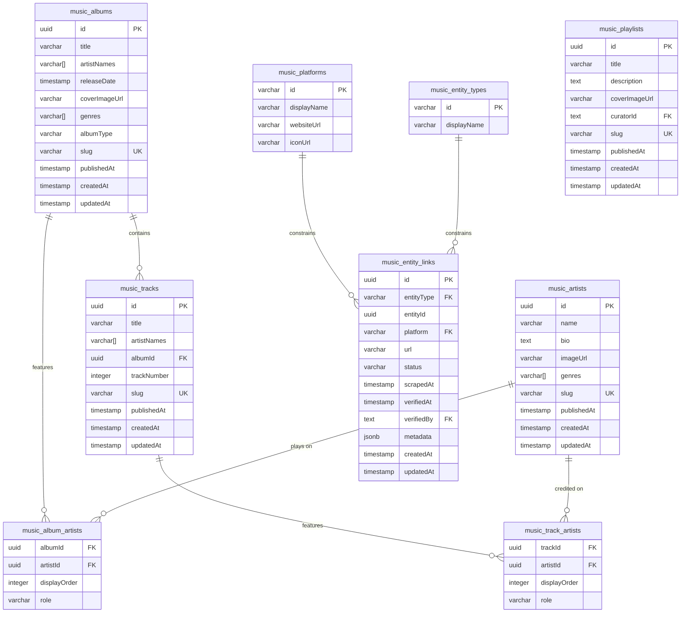
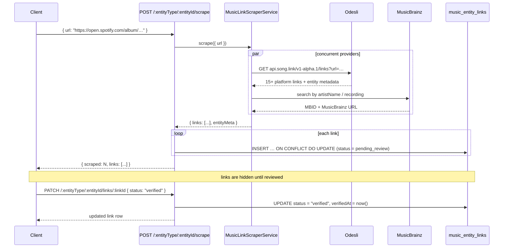
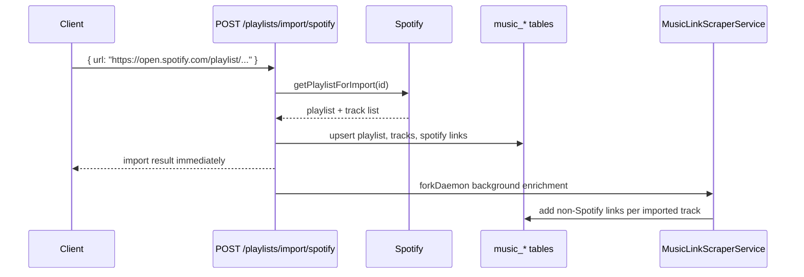

# Music Metadata — Platform-Agnostic Storage

## Overview

This feature stores music metadata (artists, albums, tracks, playlists) independently of any streaming platform. Instead of relying on Spotify or another single provider, each entity has a **links registry** that attaches it to any number of platform URLs. A scraping service auto-discovers those links from a seed URL or text-based identifiers, and a review queue lets you verify links before they go public.

## Implementation Status ✅

- **Database Schema**: ✅ Complete (`music_artists`, `music_albums`, `music_tracks`, `music_playlists`, `music_entity_links`, junction tables, seeded lookup tables)
- **API Endpoints**: ✅ Complete (full CRUD for all 4 entity types + links + scraping + artist junctions)
- **Scraper Service**: ✅ Complete (provider-first architecture — Odesli, MusicBrainz, optional Firecrawl)
- **Review Queue**: ✅ Complete (links start as `pending_review`; PATCH endpoint approves/rejects)
- **Playlist Import Enrichment**: ✅ Complete (Spotify playlist imports enqueue background non-Spotify link discovery)
- **Seed Script**: ✅ Complete (`scripts/seed-music-lookups.ts`)

---

## Database Schema

### Entity-Relationship Diagram



### Design Decisions

| Decision | Rationale |
|---|---|
| Seeded lookup tables instead of `pgEnum` | FK constraints at the DB level without a schema migration per new platform; metadata (displayName, websiteUrl) is queryable |
| `artistNames varchar[]` alongside junction table | Fast display in list views without a join; junction table (`music_album_artists`, `music_track_artists`) is the source of truth for structured queries |
| `status` on `music_entity_links` | Links scraped automatically start as `pending_review` — must be verified before appearing publicly |
| Provider-first scraper | `MusicDataProvider` interface lets new data sources (Discogs, Last.fm, etc.) be added without touching service logic |
| Unique constraint on `(entityType, entityId, platform)` | One link per platform per entity; upsert semantics on scrape |
| Background enrichment for imported playlists | Spotify import stays fast; alternate links are discovered after commit and traced separately |

## OTel / Tracing

Playlist import and enrichment emit these spans:

| Span | Purpose |
|---|---|
| `api.music.importSpotifyPlaylist` | HTTP handler for the import request |
| `musicEntity.importSpotifyPlaylist` | Import service work inside the transaction |
| `musicEntity.enrichImportedPlaylistLinks` | Background fan-out for imported tracks |
| `musicEntity.enrichTrackLinks` | Per-track scraping and link persistence |
| `musicScraper.scrape` and provider spans | External link discovery per provider |

The background span is forked so it does not block the client response, but it still appears in OTel/Sentry with playlist and track attributes.

---

## Data Flow

### Scrape & Review Flow



### Spotify Playlist Import + Background Enrichment



The import response stays fast. Alternate links are discovered after the transaction commits, then persisted in the background.

---

## API Endpoints

Base path: `https://api.gbfm.co.za/music`

### Artists

| Method | Path | Description |
|---|---|---|
| `GET` | `/artists` | List all artists |
| `POST` | `/artists` | Create an artist |
| `GET` | `/artists/:id` | Get artist by UUID |
| `PATCH` | `/artists/:id` | Update artist |
| `DELETE` | `/artists/:id` | Delete artist |

### Albums

| Method | Path | Description |
|---|---|---|
| `GET` | `/albums` | List all albums |
| `POST` | `/albums` | Create an album |
| `GET` | `/albums/:id` | Get album by UUID |
| `PATCH` | `/albums/:id` | Update album |
| `DELETE` | `/albums/:id` | Delete album |
| `PUT` | `/albums/:albumId/artists/:artistId` | Add/update artist on album |
| `DELETE` | `/albums/:albumId/artists/:artistId` | Remove artist from album |

### Tracks

| Method | Path | Description |
|---|---|---|
| `GET` | `/tracks` | List all tracks |
| `POST` | `/tracks` | Create a track |
| `GET` | `/tracks/:id` | Get track by UUID |
| `PATCH` | `/tracks/:id` | Update track |
| `DELETE` | `/tracks/:id` | Delete track |
| `PUT` | `/tracks/:trackId/artists/:artistId` | Add/update artist on track |
| `DELETE` | `/tracks/:trackId/artists/:artistId` | Remove artist from track |

### Playlists

| Method | Path | Description |
|---|---|---|
| `GET` | `/playlists` | List all playlists |
| `POST` | `/playlists` | Create a playlist |
| `GET` | `/playlists/:id` | Get playlist by UUID |
| `PATCH` | `/playlists/:id` | Update playlist |
| `DELETE` | `/playlists/:id` | Delete playlist |

### Links & Scraping

| Method | Path | Description |
|---|---|---|
| `GET` | `/:entityType/:entityId/links` | List links for an entity (filter by `?status=`) |
| `POST` | `/:entityType/:entityId/links` | Manually add a link |
| `PATCH` | `/:entityType/:entityId/links/:linkId` | Update link status (verify/reject) |
| `DELETE` | `/:entityType/:entityId/links/:linkId` | Delete a link |
| `POST` | `/:entityType/:entityId/scrape` | Trigger link discovery |
| `GET` | `/links/pending` | Admin: all pending-review links (paginated) |

---

## Example Payloads

### Create an artist

```http
POST /music/artists
Content-Type: application/json

{
  "name": "Burial",
  "bio": "South London electronic producer.",
  "genres": ["dubstep", "uk garage"],
  "slug": "burial"
}
```

Response `201`:
```json
{
  "id": "a1b2c3d4-…",
  "name": "Burial",
  "bio": "South London electronic producer.",
  "imageUrl": null,
  "genres": ["dubstep", "uk garage"],
  "slug": "burial",
  "publishedAt": null,
  "createdAt": "2026-03-06T10:00:00.000Z",
  "updatedAt": "2026-03-06T10:00:00.000Z"
}
```

---

### Create an album with multiple artists

```http
POST /music/albums
Content-Type: application/json

{
  "title": "Untrue",
  "artistNames": ["Burial"],
  "artistIds": ["a1b2c3d4-…"],
  "releaseDate": "2007-11-05",
  "albumType": "LP",
  "genres": ["dubstep"],
  "slug": "untrue"
}
```

`artistIds` populates the `music_album_artists` junction table so the relationship is queryable. `artistNames` is the denormalized copy for fast list rendering.

---

### Scrape platform links

```http
POST /music/album/b2c3d4e5-…/scrape
Content-Type: application/json

{
  "url": "https://open.spotify.com/album/5J3O2A5oPaWDxePgJdSgNJ"
}
```

Or by text identifiers (no streaming URL needed):
```json
{
  "artistName": "Burial",
  "trackTitle": "Archangel"
}
```

Response `200`:
```json
{
  "scraped": 6,
  "links": [
    {
      "id": "c3d4e5f6-…",
      "entityType": "album",
      "entityId": "b2c3d4e5-…",
      "platform": "spotify",
      "url": "https://open.spotify.com/album/5J3O2A5oPaWDxePgJdSgNJ",
      "status": "pending_review",
      "scrapedAt": "2026-03-06T10:05:00.000Z",
      "verifiedAt": null,
      "verifiedBy": null,
      "metadata": { "odesliEntityId": "…" },
      "createdAt": "2026-03-06T10:05:00.000Z",
      "updatedAt": "2026-03-06T10:05:00.000Z"
    }
  ]
}
```

---

### Verify a link

```http
PATCH /music/album/b2c3d4e5-…/links/c3d4e5f6-…
Content-Type: application/json
Cookie: <admin session>

{
  "status": "verified"
}
```

---

### Add a featured artist to a track

```http
PUT /music/tracks/d4e5f6a7-…/artists/a1b2c3d4-…
Content-Type: application/json

{
  "role": "featured",
  "displayOrder": 1
}
```

---

## Scraper Providers

The `MusicLinkScraperService` uses a provider-first architecture. Providers are run in order; later providers override earlier ones for the same platform.

| Provider | Auth | Use Case |
|---|---|---|
| **Odesli** | None (rate-limited) | Convert one streaming URL to 15+ platform links |
| **MusicBrainz** | None (1 req/sec) | MusicBrainz links, MBIDs, recording-oriented text search |
| **Firecrawl** | `FIRECRAWL_API_KEY` env var | AI-powered scrape of artist pages for social/Discord links |

### Adding a new provider

1. Implement `MusicDataProvider`:
   ```ts
   class DiscogsProvider implements MusicDataProvider {
     readonly name = 'discogs'
     fetchLinks(input: MusicScrapeInput): Effect.Effect<ProviderResult, MusicScraperError> { … }
   }
   ```
2. Add it to the `providers` array in `MusicLinkScraperServiceLive` in `music-link-scraper.service.ts`.

---

## Setup

### 1. Apply the migration

```bash
cd apps/vps
bun db:migrate
```

This migrates and seeds the lookup tables automatically.

### 2. Re-seed lookup tables manually if needed

```bash
bun run db:seed:music-lookups
```

This is safe to rerun if platform or entity type definitions change.

### 3. Optional: enable Firecrawl

Set `FIRECRAWL_API_KEY` in your environment. The scraper automatically includes Firecrawl if the key is present.
