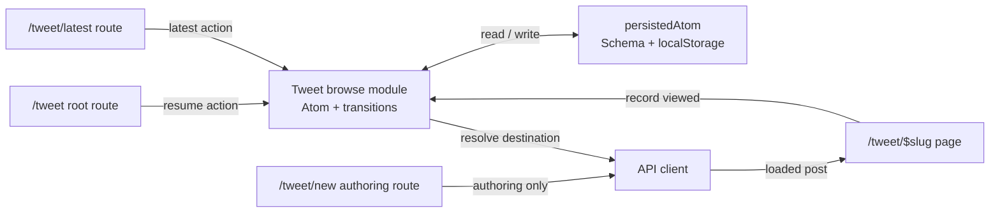

# Tweet Browse History

## Summary

Persist the user's lightweight tweet browsing progress in the web app so that
visiting `/tweet` resumes at the last successfully viewed tweet instead of
always opening the newest tweet.

The feature is intentionally local and small:

- Use the existing Effect Atom and `persistedAtom` seam.
- Keep one resume pointer.
- Keep the existing bounded set of seen slugs for random-tweet exclusion.
- Store a post identity, not a numeric feed offset.
- Use `localStorage`; do not introduce IndexedDB or a server table yet.

## Current Call Path

### Root route

`apps/www/src/routes/tweet/index.tsx` currently:

1. Creates the API client.
2. Fetches the newest micro-post with `limit: 1` and `offset: 0`.
3. Redirects to `/tweet/$slug` for that post.
4. Redirects to `/` when no post exists.

It has no access to persisted browsing progress.

### Tweet route

`apps/www/src/routes/tweet/$slug.tsx` currently:

1. Fetches a micro-post by slug in the route loader.
2. Returns the loaded post to the page component.
3. Calls `useMarkTweetSeen()` from an effect after the page mounts.

This is the correct point to record progress because the route has loaded a
real post and the user has entered its page.

### Existing persistence

`apps/www/src/store/persistedAtom.ts` provides:

- JSON serialization to `localStorage`.
- Schema decoding on read.
- Fallback to a known default for malformed or old data.
- An Effect Atom for reactive reads and writes.

`apps/www/src/store/tweetSeen.ts` currently persists a bounded array of slugs
under `gbfm-tweet-seen.json`.

## Goals

- Opening `/tweet` resumes the last viewed tweet for the default tweet feed.
- `/tweet/latest` explicitly opens the newest published tweet.
- `/tweet/new` opens the authenticated authoring flow for a new tweet.
- A first-time visitor still opens the newest tweet.
- A deleted or unavailable saved tweet falls back to the newest tweet.
- Successfully loaded tweets remain available for random-tweet exclusion.
- Persistence survives reloads and browser restarts.
- Malformed persisted data is safely ignored.
- The public module interface stays small.

## Non-goals

- No visit-by-visit event log.
- No view count.
- No cross-device synchronization.
- No authenticated server-side history.
- No IndexedDB.
- No attempt to persist a numeric pagination offset.
- No resume behavior for search or tag-filtered feeds in the first version.

## Entry Actions

The browse root should not be the only way to enter the tweet stream. Common
intentions should have explicit URLs so links, navigation controls, and future
keyboard shortcuts can target stable actions.

```ts
type TweetEntryAction = 'resume' | 'latest'
```

| URL | Action | Resolution |
| --- | --- | --- |
| `/tweet` | `resume` | Open the saved `lastViewed` tweet; fall back to latest. |
| `/tweet/latest` | `latest` | Open the newest published tweet; ignore saved progress. |
| `/tweet/new` | `author` | Open the authenticated authoring flow for a new tweet. |
| `/tweet/$slug` | `direct` | Open the explicitly requested tweet. |

`/tweet/new` is an authoring action, not a browsing action. It should require
the same authentication and authorization behavior as the existing new-tweet
flow.

Each action resolves to a slug and then redirects to the canonical
`/tweet/$slug` route. The slug page remains the only place that records a
successful view.

```text
resolve(action)
  resume -> saved lastViewed.slug, or latest
  latest -> latest published tweet
  direct -> requested slug
```

The `/tweet` and `/tweet/latest` browse routes should share one internal
resolver rather than duplicating API calls and fallback logic. The authoring
route is separate and must not invoke the browse resolver.

## Domain Model

The persisted state is a snapshot, not an append-only event log.

```ts
type TweetBrowseState = {
  readonly version: 1
  readonly lastViewed: TweetResumePoint | null
  readonly seenSlugs: readonly string[]
}

type TweetResumePoint = {
  readonly postId: string
  readonly slug: string
  readonly viewedAt: number
}
```

Example:

```json
{
  "version": 1,
  "lastViewed": {
    "postId": "post-123",
    "slug": "a-note-about-music",
    "viewedAt": 1754055600000
  },
  "seenSlugs": [
    "a-note-about-music",
    "another-note"
  ]
}
```

### Invariants

- `lastViewed` is either `null` or a complete post identity.
- `postId` is the stable identity used for the resume record.
- `slug` is the navigable URL value and may change if content is edited.
- `viewedAt` is an epoch-millisecond timestamp.
- `seenSlugs` contains no duplicates.
- `seenSlugs` is ordered oldest-to-newest, matching the current random-post
  exclusion behavior.
- `seenSlugs` is capped at 200 entries.
- A successful view updates `lastViewed` even if the slug was already in
  `seenSlugs`.

The numeric offset is deliberately absent. Feed ordering can change when a
post is published, edited, deleted, or filtered. A stable post identity is a
more reliable resume cursor.

## Schema

The state should be decoded at the storage boundary with Effect Schema.

Conceptually:

```ts
const TweetResumePoint = Schema.Struct({
  postId: Schema.String,
  slug: Schema.String,
  viewedAt: Schema.Number
})

const TweetBrowseState = Schema.Struct({
  version: Schema.Literal(1),
  lastViewed: Schema.NullOr(TweetResumePoint),
  seenSlugs: Schema.Array(Schema.String)
})
```

The fallback is:

```ts
const initialTweetBrowseState: TweetBrowseState = {
  version: 1,
  lastViewed: null,
  seenSlugs: []
}
```

The persisted key should be a new state key, for example:

```text
gbfm-tweet-browse-state.json
```

The existing `tweetSeen` key is not required as a compatibility concern for
this design. If preserving existing local data is desired, that should be a
separate, explicit migration decision rather than part of the core interface.

## Module Interface

The module should hide the Atom update and persistence policy from callers.
Callers should not know how the state is serialized or capped.

```ts
type TweetIdentity = {
  readonly postId: string
  readonly slug: string
}

export const tweetBrowseAtom: Atom.Atom<TweetBrowseState>

export const useTweetBrowseState: () => TweetBrowseState

export const useRecordTweetViewed: () => (tweet: TweetIdentity) => void

export const useResumeTweet: () => TweetResumePoint | null

export const useSeenTweetSlugs: () => readonly string[]

export const useResetTweetBrowse: () => () => void
```

The route loader needs a non-React read for the root redirect. The module
should expose a small synchronous read of the decoded initial state rather
than making the route reach into `localStorage` directly:

```ts
export const readTweetBrowseState: () => TweetBrowseState
```

This read is safe during SSR because it returns the fallback when `window` is
unavailable, matching `persistedAtom` behavior.

The module may expose only the functions actually needed by the application.
The important design constraint is that persistence and state transitions stay
inside the module.

## Events

These are conceptual domain events. They do not need to become a persisted
event log or a general event bus.

```ts
type TweetBrowseEvent =
  | {
      readonly type: 'tweet-root-opened'
      readonly action: TweetEntryAction
    }
  | { readonly type: 'tweet-viewed'; readonly tweet: TweetIdentity }
  | { readonly type: 'tweet-browse-reset' }
```

### `tweet-root-opened`

Produced by `/tweet` and `/tweet/latest` with the requested entry action when
they need to choose a destination. This event is
observational. It does not mutate persisted state.

### `tweet-viewed`

Produced after the `$slug` loader successfully resolves a post and the page
has mounted. It mutates both `lastViewed` and `seenSlugs`.

This event must not be produced by:

- A failed route loader.
- A link prefetch.
- A request for the newest post made only to choose a fallback.
- A random-post API response before navigation succeeds.

### `tweet-browse-reset`

Clears the resume pointer and seen-slug list. This is useful for a future
reset control and makes the state transition explicit even if the UI is not
added immediately.

## State Transitions

### Initial state

```text
lastViewed = null
seenSlugs = []
```

No prior browsing state exists, or persisted data failed schema decoding.

### Root opened with no resume point

```text
tweet-root-opened
  -> lastViewed is null
  -> fetch newest tweet
  -> redirect to newest tweet
```

The state remains unchanged until the destination tweet successfully loads.

### Latest explicitly requested

```text
/tweet/latest
  -> resolve latest published tweet
  -> redirect to /tweet/$slug
  -> tweet-viewed updates lastViewed to that tweet
```

An explicit latest request deliberately ignores the existing resume point.

### Root opened with a resume point

```text
tweet-root-opened
  -> lastViewed exists
  -> attempt to load lastViewed.slug
  -> redirect to lastViewed.slug
```

The root route should not fetch the newest post first in this case.

### Resume point is stale

```text
tweet-root-opened
  -> attempt to load lastViewed.slug
  -> post is unavailable
  -> fetch newest tweet
  -> redirect to newest tweet
```

The stale `lastViewed` value can remain in storage until a successful view
replaces it. Alternatively, the root route can clear it before fallback. The
preferred simple behavior is to clear it when the saved route is definitively
not found, so repeated visits do not retry a dead slug.

### Tweet successfully viewed

```text
tweet-viewed(tweet)
  -> lastViewed = {
       postId: tweet.postId,
       slug: tweet.slug,
       viewedAt: now()
     }
  -> if tweet.slug is absent from seenSlugs, append it
  -> if seenSlugs exceeds 200, remove oldest entries
```

The update should be one Atom transaction and one persistence write.

### Same tweet viewed again

```text
tweet-viewed(tweet)
  -> update lastViewed.viewedAt
  -> do not duplicate tweet.slug in seenSlugs
```

No view count is maintained.

### Browse reset

```text
tweet-browse-reset
  -> lastViewed = null
  -> seenSlugs = []
```

## Call Stack

### Opening `/tweet`

```text
User navigates to /tweet
  -> TanStack Router matches routes/tweet/index.tsx
  -> resolver receives action = resume
  -> root loader reads tweetBrowseState
  -> if lastViewed exists:
       API client: post.getMicroPostBySlug({ slug: lastViewed.slug })
       success -> redirect /tweet/$slug
       not found -> clear stale resume and continue
  -> API client: post.getMicroPosts({ limit: 1, offset: 0 })
  -> no posts -> redirect /
  -> latest post -> redirect /tweet/$slug
```

The root loader should continue using the existing Effect error-reporting
pattern with `captureException` for unexpected API failures. A not-found
resume failure is expected control flow and should not be reported as an
application error if the API client exposes a distinguishable not-found
error.

### Opening `/tweet/latest`

```text
User navigates to /tweet/latest
  -> matching action route invokes the shared resolver
  -> resolver selects a slug according to the action
  -> router redirects to /tweet/$slug
  -> slug loader and page follow the normal successful-view path
```

The latest route should remain thin. It chooses an intent and delegates
selection to the resolver; it should not write browsing state itself.

### Opening `/tweet/new`

```text
User navigates to /tweet/new
  -> authoring route checks authentication and authorization
  -> render the new-tweet authoring flow
  -> save the new tweet through the existing authoring path
  -> optionally navigate to /tweet/$slug after a successful save
```

Authoring does not record browse progress merely because the editor opened or
because a tweet was saved. Progress is recorded only when the published tweet
is subsequently viewed through `/tweet/$slug`.

### Loading `/tweet/$slug`

```text
User enters /tweet/$slug
  -> TanStack Router runs the slug loader
  -> API client: post.getMicroPostBySlug({ slug })
  -> successful response returns post data
  -> TweetPostPage mounts
  -> effect calls recordTweetViewed({ postId: post.id, slug })
  -> Atom update computes the next TweetBrowseState
  -> persistedAtom writes JSON to localStorage
```

The page should continue to use the route-loaded post as the source of truth.
The persistence module records the loaded post; it does not fetch posts or
validate slugs against the API.

### Random navigation

```text
User selects random tweet
  -> useRandomMicroPost reads seenSlugs from tweetBrowseAtom
  -> API receives seen slugs as the exclusion list
  -> router navigates to returned slug
  -> slug loader succeeds
  -> tweet-viewed updates lastViewed and seenSlugs
```

The random navigation code should not independently persist a seen slug. The
successful tweet page is the single write path for viewed progress.

Random navigation selects an arbitrary tweet excluding seen slugs. It
eventually uses the same `/tweet/$slug` recording path as every other view.

### Previous/next navigation

```text
User selects previous or next tweet
  -> TweetNav navigates to the target slug
  -> target slug loader succeeds
  -> tweet-viewed updates lastViewed and seenSlugs
```

This makes all navigation paths consistent: direct links, random navigation,
previous/next navigation, and browser history all record through the same
page-level transition.

## Interaction Diagram



## Persistence and Runtime Boundaries

`localStorage` is sufficient because this state is a small bounded snapshot.
It avoids introducing an asynchronous storage boundary into the route loader
and matches the existing application convention.

IndexedDB would be appropriate only if the requirements change to include:

- An unbounded or very large visit history.
- Individual visit events rather than the latest state.
- Complex queries over history.
- Cross-device synchronization backed by a server.

None of those requirements exists here.

The persisted value is untrusted input even though it originated in this app.
It must always be JSON parsed and Schema decoded before use. Invalid data must
produce `initialTweetBrowseState` rather than throwing during route startup.

## Edge Cases

### Empty feed

If there is no saved resume point and the newest-post query returns no data,
preserve the current behavior and redirect to `/`.

### Saved post deleted

Treat a clear not-found response as a stale resume point, clear it, and fall
back to the newest tweet.

### Saved post request fails transiently

Do not silently treat every API failure as a stale resume point. Preserve the
existing error reporting and route error behavior for network, auth, and
server failures. Only a known not-found result should trigger fallback.

### Malformed storage

Schema decoding returns the initial state. The next successful view replaces
the malformed value with valid state.

### Local storage unavailable

The existing persistence adapter already treats server rendering and storage
write failures as non-fatal. The feature becomes session-only for that browser
environment.

### React development remounts

Recording a view is idempotent with respect to `seenSlugs`. It updates the
resume timestamp more than once if the page effect runs twice, which is
harmless for this feature because no view count is kept.

## Implementation Plan

1. Replace the slug-array schema in `apps/www/src/store/tweetSeen.ts` with the
   `TweetBrowseState` schema and initial state.
2. Keep the existing maximum of 200 seen slugs.
3. Add a single state update operation that records `lastViewed` and appends
   the slug when absent.
4. Preserve the existing hooks needed by random-post navigation, or update
   their callers to read `seenSlugs` from the new module.
5. Add a non-React decoded read for the `/tweet` root loader.
6. Update `apps/www/src/routes/tweet/$slug.tsx` to record the loaded post's
   stable ID and slug through the new operation.
7. Add a shared tweet-entry resolver that accepts `resume`, `latest`, or
   `new` and returns a destination slug.
8. Add `/tweet/latest` as a browse action route that delegates to the
   resolver.
9. Move or expose the existing authoring flow at `/tweet/new`, preserving its
   authentication and authorization behavior.
10. Update `apps/www/src/routes/tweet/index.tsx` to resolve `resume` before
   fetching the newest tweet.
11. Handle only a known not-found resume error as fallback; preserve existing
   reporting for other failures.
12. Add tests for state transitions, action resolution, authoring routing, and persistence
   boundary behavior.
13. Run `bun precommit`.

## Verification Plan

Tests should cross the module interface and the actual persistence seam where
practical.

### State behavior

- Initial state has no resume point and no seen slugs.
- Recording a tweet sets `lastViewed`.
- Recording a tweet appends its slug once.
- Recording the same tweet again does not duplicate its slug.
- Recording more than 200 distinct tweets removes the oldest slugs.
- Recording a newer tweet replaces the resume point.
- Reset clears both resume and seen slugs.

### Persistence behavior

- A valid stored state is restored.
- Malformed JSON returns the fallback state.
- Schema-invalid JSON returns the fallback state.
- A successful update writes the complete state in one JSON value.

### Root route behavior

- No resume point loads the newest tweet.
- A valid resume point redirects to its slug.
- A known missing resume post falls back to the newest tweet.
- An empty feed redirects to `/`.
- Unexpected API errors retain the existing error behavior.

### Entry action behavior

- `/tweet/latest` always resolves the newest published tweet.
- `/tweet/new` opens the authenticated authoring flow.
- Unauthenticated users receive the existing sign-in/auth behavior.
- Entry routes do not write state before the destination loads.
- Random navigation remains distinct from explicit latest navigation.

### Page integration

- A successfully loaded tweet records its ID and slug.
- A failed tweet load does not update browsing state.
- Random navigation continues to use the bounded seen-slug list.

## Open Decision

The one decision to make before implementation is whether to preserve the
existing `gbfm-tweet-seen.json` data. The simplest design starts with the new
versioned state key and treats existing local data as disposable. A migration
can be added later only if retaining current users' random-exclusion history
is important.
